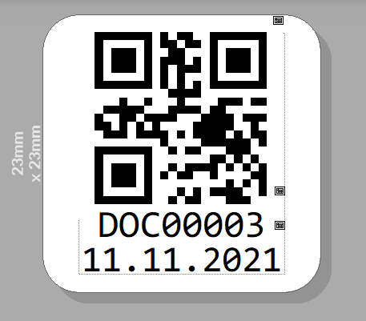

# scanprep

tool that watches a input folder for new pdfs and splits it up for better processing by marking qr-code stickers

## DISCLAIMER: this is totally untested. if you somehow find this and want to use it, you probably have to do some adjustments to better match your scanner settings.

## example qrcode sticker


<br>
Valid qr codes:

- SPLIT or DOC\d{4} (DOC00000-DOC99999): new document starting with current document
- SPLITSKIP: new document with next document, current page is discarded (used for blank seperator pages)

## usage with docker-compose

```
docker-compose up -d
```

## manual usage

### installation

clone repo

```
# install depenencies of node-quirc
sudo apt install libpng-dev zlib1g-dev libjpeg-dev

cd scanprep
npm install
```

### usage

```
mkdir in
mkdir out
WATCH_DIR=./in OUT_DIR=./out npm run start
```

## scanning

for scanning via e.g. sane there are countless tutorial out there. This is the script i came up with, that gets executed via button presses on buttons connected via gpio.

```
#!/bin/bash

case $1 in
duplex) pages_per_page="2"
        source="ADF Duplex";;
simplex)   pages_per_page="1"
        source="ADF Front";;
*)    printf "Usage $0 duplex/simplex all/one" $0
          exit 2;;
esac

case $2 in
one)    more_args="--batch-count=$pages_per_page";;
all)   more_args="";;
*)    printf "Usage $0 duplex/simplex all/one" $0
          exit 2;;
esac

current_date=`date +%Y%m%d_%H%M%S`
out_dir=/mnt/ScannerInbox/fujitsu/$current_date
sudo mkdir -p $out_dir
cd $out_dir
scanimage -d 'fujitsu' --source "$source" --mode Color  --page-width 210 --page-height 297 --resolution 300 --format jpeg --batch=p%04d.jpeg $more_args
echo -n $1 > done
```
